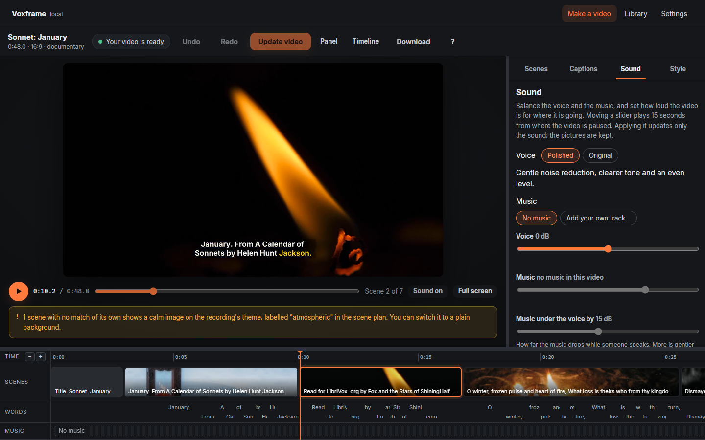
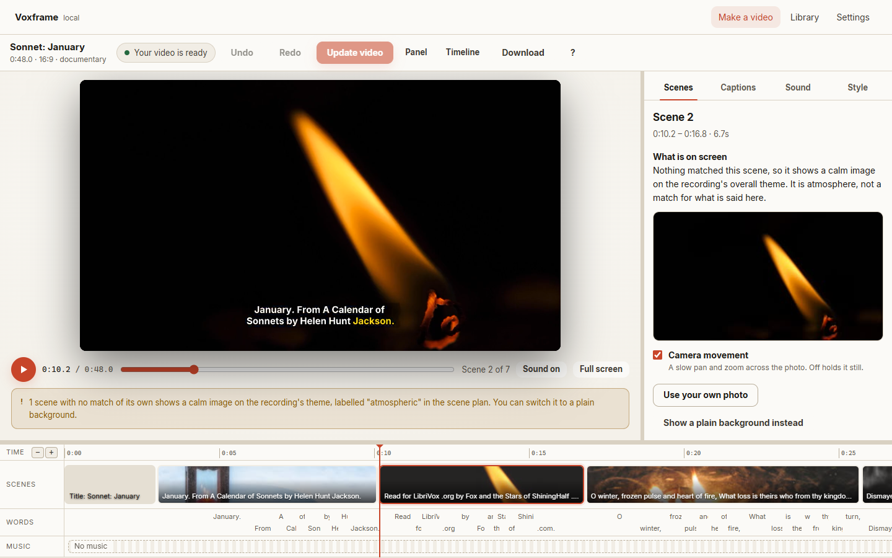

<p align="center">
  
</p>

<h1 align="center">VoxFrame</h1>

<p align="center">
  <strong>Turn your recordings into videos and Shorts you can direct — on your own computer.</strong><br>
  Free and open source. No account or subscription. Your recordings stay on your computer.
</p>

<p align="center">
  <a href="https://github.com/Ngum12/voxframe/releases/latest"><strong>Download</strong></a> ·
  <a href="docs/install-windows.md">Install on Windows</a> ·
  <a href="docs/install-mac.md">Install on a Mac</a> ·
  <a href="docs/first-video.md">Your first video</a>
</p>

---

**Your voice. Your footage. Your direction.**

Start with a recording: a lesson, a talk, an interview or a video of you speaking.
VoxFrame transcribes it, times the captions and matches pictures to what you say.
Then take control in the studio: build a Short, audition creative directions,
compare rendered edits, refine the speech and shape the sound.

Keep yourself on screen, bring in cutaways and text beats, and decide how each
photo moves. Preview your choices before saving. Undo and redo edits, then update
the finished video without starting the whole project again.


## From recording to finished video

**Upload → choose a passage → audition → compare → refine → review → export.**

1. **Bring your recording.** Start with sound or video. With **Use my video**,
   your footage stays in sync with your voice; vertical framing can follow your
   face while pictures appear as cutaways.
2. **Find your Short.** Review suggested 3–60 second passages, inspect the
   opening and ending, and adjust the first and last words yourself. Or open
   **Story Composer** to trim, reorder and combine transcript passages into a
   hook, key points and an ending, then preview the sequence before saving.
3. **Audition a direction.** Try **Clean authority**, **High energy** or
   **Cinematic story**, with optional matching captions. Inspect the planned
   beats and render a preview using your actual footage and narration.
   **Place visuals** pins a speaker shot, project cutaway or text treatment
   to chosen words without changing the story duration.
   In **Director → Complete auditions**, hear your current soundtrack or a
   saved track inside the video preview, then compare complete treatments.
4. **Compare the edits.** Put two auditions of the same passage side by side.
   A shared playhead starts, pauses and scrubs both. Switch which version you
   hear, then save the passage, direction and captions you prefer together.
   Complete auditions save the previewed visuals, captions, track and mix
   together as one undoable choice.
5. **Refine the delivery.** Review pauses, standalone fillers such as “um” and
   “euh,” and immediately repeated phrases. Select the cuts you want and listen
   to a preview before saving them.
6. **Finish for your audience.** Shape the music, review potential issues, and
   choose export settings for Shorts, Reels, TikTok or WhatsApp. Save your edits,
   click **Update video**, then download the finished MP4.

Keep the full recording if you prefer: the studio also handles longer videos,
chapter cards and highlights. [Walk through the controls](docs/web-app.md).

## Make it your own

- **Captions with character.** English and French transcription, timed words,
  editable text, animation, colour, placement and emphasis. Burn captions into
  the video and keep SRT and VTT subtitle files too.
- **Pictures with a purpose.** Match photos and clips from your own library,
  choose alternatives or bring your own image. Optional online discovery finds
  more material, with creator and licence credits retained.
- **Photo movement you direct.** Choose zoom in/out or pan left, right, up or
  down, adjust the strength, and render a silent picture preview before saving.
  Automatic movement and **Hold still** are available too. Pans crop slightly
  to make room for travel; previews show up to 12 seconds at the scene's original
  movement speed.
- **Sound shaped around speech.** Gentle voice polish, music fitted to the
  speaker, and loudness targets for YouTube, social media, WhatsApp and podcasts.
  Choose **Steady bed**, **Cinematic rise** or **Punch & breathe**, then hear the
  opening and ending. Build your own music library or discover openly licensed
  tracks when you enable online music search.
- **Batch Shorts from one recording.** Shortlist up to six distinct word ranges,
  choose looks and framing, preview each with sound, and export the reviewed
  set as separate projects. Download each clip, stop or resume individual
  exports, and keep working with the original recording.
- **Signature style kits.** Save captions and sound, with optional transitions,
  photo movement and text styling. Reuse a kit after uploading, or audition it
  on a 3–60 second story in Director and apply the exact preview with Undo.
  Your words, cuts and media stay specific to each project.
- **A finishing review.** Inspect potential caption, framing, timing and sound
  issues, with evidence and a route to the relevant controls. Mark intentional
  choices checked. The review uses saved settings and metadata; watch and listen
  to the updated video before sharing it.
- **An editor that keeps you in control.** The video stays visible while you
  work with scenes and timed words. Undo and redo, saved edits, reusable render
  segments and interrupted-render recovery keep work from being lost.
- **Two studio looks.** Dark and light themes, responsive layouts and keyboard
  navigation. Work locally without an account or subscription.

<details>
<summary>See the sound controls and light theme</summary>





</details>

## Download

This README describes the current source build. Packaged installers follow
tagged releases; check the [release notes](https://github.com/Ngum12/voxframe/releases)
for the features included in your download.

| | |
|---|---|
| **Windows 10 and 11** | [`Voxframe-<version>-Windows-setup.exe`](https://github.com/Ngum12/voxframe/releases/latest) — [install guide](docs/install-windows.md) |
| **macOS, Apple Silicon** (early) | [`Voxframe-<version>-macOS-arm64.dmg`](https://github.com/Ngum12/voxframe/releases/latest) — [install guide](docs/install-mac.md) |

Neither is code-signed yet, so Windows and macOS ask you to confirm the first
time; the guides show exactly where. The first start downloads the speech and
picture models (about 3.1 GB, or 750 MB for the Lite version) and shows its
progress. Once the required models and any optional music tools are downloaded,
you can edit and export with local assets without the internet. Online discovery
needs a connection.

## Privacy

Your recordings and videos stay on your computer. Speech recognition, editing
and rendering run locally, with no account, tracking or telemetry.

Online image and music discovery are optional. Image searches can send words
from a scene; music searches send the words you type. Previewing or saving an
online result downloads media from its original host. Model downloads, optional
music-tool downloads and update checks also use the internet.
[The privacy note](docs/privacy.md) explains these connections.

## For developers

```bash
git clone https://github.com/Ngum12/voxframe
cd voxframe
pip install -e ".[dev,app,music]"
python -m playwright install chromium
voxframe doctor        # what is installed, and what is missing
voxframe web           # the app in your browser
pytest                 # full suite; some checks need downloaded models
```

You need Python 3.11–3.13 and FFmpeg with libass. The web app's built files are
committed, so Node is only needed to change it (`cd web && npm install && npm run
build`). How it works: [architecture](docs/architecture.md); why it works that
way: [DECISIONS.md](DECISIONS.md), every significant choice and what it was
measured against.

## Licensing

Voxframe is licensed under the **Apache License 2.0** ([LICENSE](LICENSE)): use,
change, share and sell it, and anything you make with it, at no cost.

**FFmpeg.** The Windows installer and the Mac app include FFmpeg, which is
licensed under the GPL, as a separate program in its own folder, with its licence
and a note of where its source comes from. Every release also carries FFmpeg's
complete source and a list of the libraries compiled into each build. Voxframe runs it as a separate
process and does not link to it, so Voxframe's own code, and yours, are not
under the GPL. Installed with `pip`, Voxframe uses the FFmpeg already on your
computer.

**Everything else** Voxframe uses, with its licence, is listed in
[THIRD_PARTY_LICENSES](THIRD_PARTY_LICENSES). All of it permits free commercial
use.

**Video codecs.** The videos Voxframe makes are H.264, a format covered by patent
pools that are separate from any software licence. Making and sharing your own
videos is not normally where those licences apply. *This is not legal advice.*

## Reporting a problem

Bugs and ideas: [open an issue](https://github.com/Ngum12/voxframe/issues).
What's planned: [ROADMAP.md](ROADMAP.md). To help: [CONTRIBUTING.md](CONTRIBUTING.md).
Anything else: [the maintainer on LinkedIn](https://www.linkedin.com/in/ngum-dieudonne/).
Security problems: privately, as [SECURITY.md](SECURITY.md) describes.
