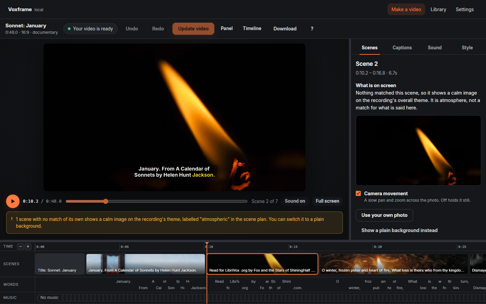

<p align="center">
  
</p>

<h1 align="center">Voxframe</h1>

<p align="center">
  <strong>Turn a recording into a captioned video with matching pictures — on your own computer.</strong><br>
  Free and open source. No account, no subscription, no upload.
</p>

<p align="center">
  <a href="https://github.com/Ngum12/voxframe/releases/latest"><strong>Download</strong></a> ·
  <a href="docs/install-windows.md">Install on Windows</a> ·
  <a href="docs/install-mac.md">Install on a Mac</a> ·
  <a href="docs/first-video.md">Your first video</a>
</p>

---

Give Voxframe a lesson, a talk or a podcast episode. It hears every word,
captions each one as it is spoken, splits the recording into scenes, and finds a
photograph or clip for each scene that fits what is said. Then you finish it in
the studio: the video stays in view while you change anything, with undo for
every change.



## What it does

- **Word-by-word captions**, in English or French, burned into the video, plus
  SRT and VTT subtitles.
- **You on screen**, from a video file: your picture in sync with your
  voice, with the matching pictures cutting in when you mention what they
  show. A vertical crop follows your face as you move, and captions keep
  clear of it.
- **Pictures that fit**, matched by meaning from your own library — or, if you
  turn it on and add a free key, from Pexels, Pixabay and Openverse. Every
  picture is credited with its photographer and licence.
- **A finished look**: slow camera movement, crossfades, title and chapter
  cards, and your own music, edited to the speaker: cut on the beat, quieter
  under every sentence, rising into pauses, and ending on the last word.
- **Sound that is ready to share**: gentle voice polish, the music kept under
  the voice, and the right loudness for YouTube, social media, WhatsApp or a
  podcast. Every video's sound is checked.
- **The studio**: swap a picture, correct a caption, add a title, change the
  music, and see each change before you make it. Undo anything. When you
  update the video, only what you changed is made again.
- **Dark or light**, following your computer, and usable entirely from the
  keyboard.
- **Long recordings**: chapters at long pauses, a short highlights version, and
  a render that resumes if it is interrupted.

## Download

| | |
|---|---|
| **Windows 10 and 11** | [`Voxframe-<version>-Windows-setup.exe`](https://github.com/Ngum12/voxframe/releases/latest) — [install guide](docs/install-windows.md) |
| **macOS, Apple Silicon** (early) | [`Voxframe-<version>-macOS-arm64.dmg`](https://github.com/Ngum12/voxframe/releases/latest) — [install guide](docs/install-mac.md) |

Neither is code-signed yet, so Windows and macOS ask you to confirm the first
time; the guides show exactly where. The first start downloads the speech and
picture models (about 3.1 GB, or 750 MB for the Lite version) and shows its
progress. After that, Voxframe works without the internet.

## Privacy

Your recordings and videos never leave your computer. Voxframe goes online only
to download its models when you ask, to search free image services if you turn
that on, and to check for updates when you press the button.
[The privacy note](docs/privacy.md) lists exactly what is sent, and to whom.

## For developers

```bash
git clone https://github.com/Ngum12/voxframe
cd voxframe
pip install -e ".[dev,app]"
python -m playwright install chromium
voxframe doctor        # what is installed, and what is missing
voxframe web           # the app in your browser
pytest                 # the full suite, browser tests included
```

You need Python 3.11–3.13 and FFmpeg with libass. The web app's built files are
committed, so Node is only needed to change it (`cd web && npm install && npm run
build`). How it works: [architecture](docs/architecture.md); why it works that
way: [DECISIONS.md](DECISIONS.md), every significant choice and what it was
measured against.

## Licensing

Voxframe is licensed under the **Apache License 2.0** ([LICENSE](LICENSE)): use,
change, share and sell it, and anything you make with it, at no cost.

**FFmpeg.** The Windows installer and the Mac app include FFmpeg, which is
licensed under the GPL, as a separate program in its own folder, with its licence
and a note of where its source comes from. Every release also carries FFmpeg's
complete source and a list of the libraries compiled into each build. Voxframe runs it as a separate
process and does not link to it, so Voxframe's own code, and yours, are not
under the GPL. Installed with `pip`, Voxframe uses the FFmpeg already on your
computer.

**Everything else** Voxframe uses, with its licence, is listed in
[THIRD_PARTY_LICENSES](THIRD_PARTY_LICENSES). All of it permits free commercial
use.

**Video codecs.** The videos Voxframe makes are H.264, a format covered by patent
pools that are separate from any software licence. Making and sharing your own
videos is not normally where those licences apply. *This is not legal advice.*

## Reporting a problem

Bugs and ideas: [open an issue](https://github.com/Ngum12/voxframe/issues).
What's planned: [ROADMAP.md](ROADMAP.md). To help: [CONTRIBUTING.md](CONTRIBUTING.md).
Anything else: [the maintainer on LinkedIn](https://www.linkedin.com/in/ngum-dieudonne/).
Security problems: privately, as [SECURITY.md](SECURITY.md) describes.
