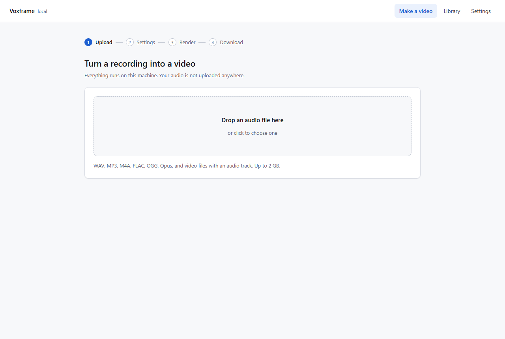
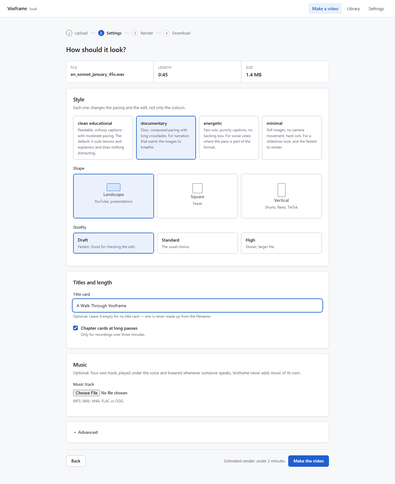
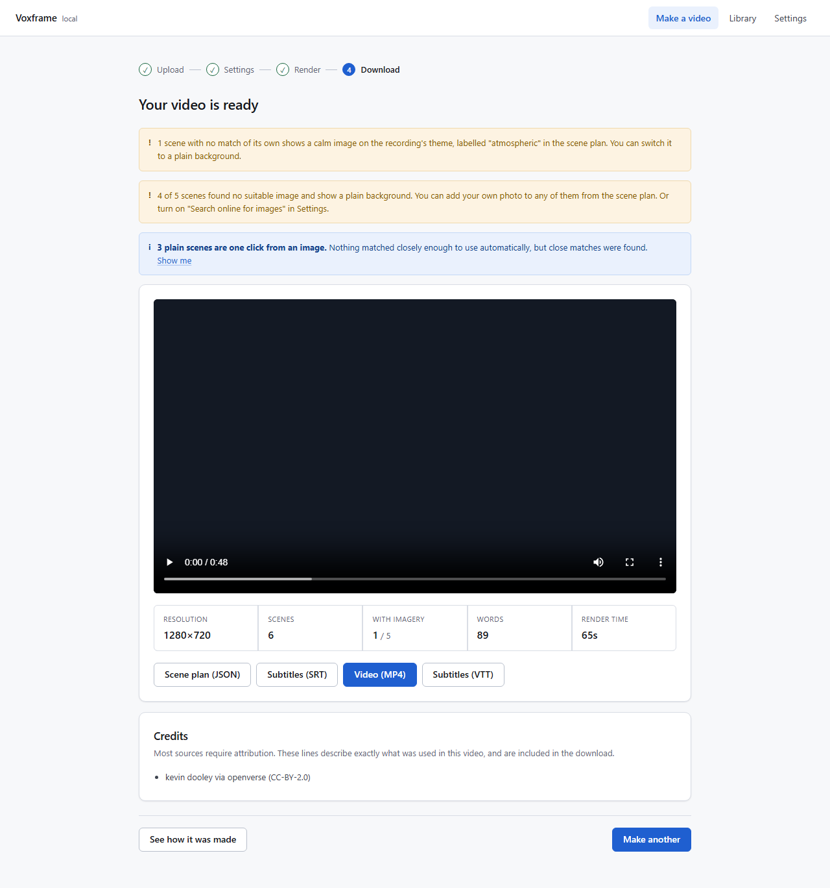
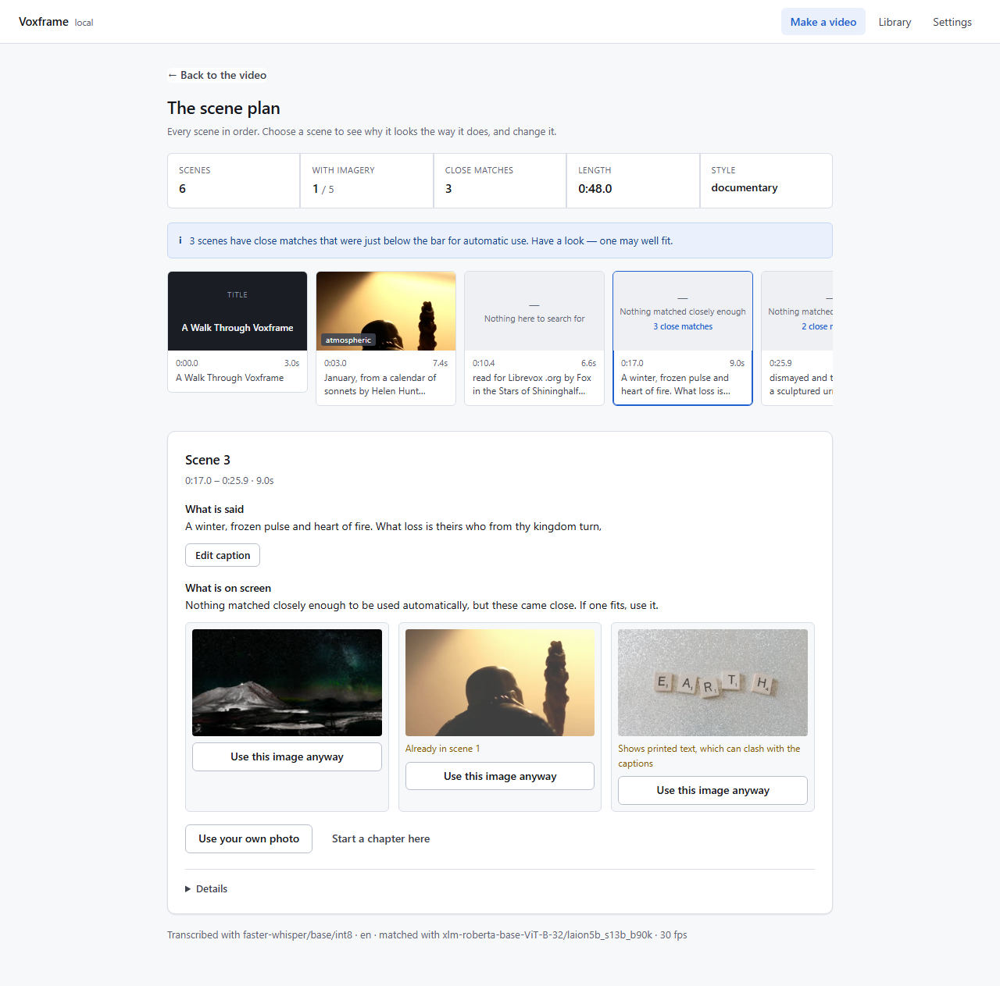

# Your first video

About five minutes, most of it waiting for the video to be made.

## 1. Choose a recording

Open Voxframe. Drop a recording onto the page, or click to choose one: a
lesson, a talk, a podcast episode. WAV, MP3, M4A, FLAC, OGG and videos with a
sound track all work.

## 2. Choose how it looks

Pick a style, a shape (landscape for YouTube, vertical for Shorts and Reels,
square for feeds) and a quality. Give it a title if you like — Voxframe never
invents one. You can add your own music, too.

Click **Make the video**. The page shows each step as it happens: hearing the
speech, finding pictures, making the video. A 45-second recording takes about a
minute on a normal laptop.

## 3. Watch and download

When it is ready, the video plays on the page. Download it, with its subtitles
(SRT and VTT). The credits for every picture are listed underneath.

## 4. Change anything

Click **See how it was made** to open the scene plan: every scene in order, what
is said in it, and why it shows what it shows. Choose a scene to change it:

- use one of the close matches, or another picture Voxframe considered;
- use your own photo;
- correct a caption;
- add a title or start a chapter.

Then click **Update the video**. Only the scenes you changed are made again.

## Getting better pictures

Voxframe matches scenes against pictures in your **Library**. With an empty
library, scenes show a calm plain background. Two ways to fill it:

- **Library → Add your own photos and clips**, credited to you.
- **Settings → Search online for images**, with a free Pexels or Pixabay key:
  Voxframe then finds free stock pictures for scenes your library cannot fill,
  and credits each one.
