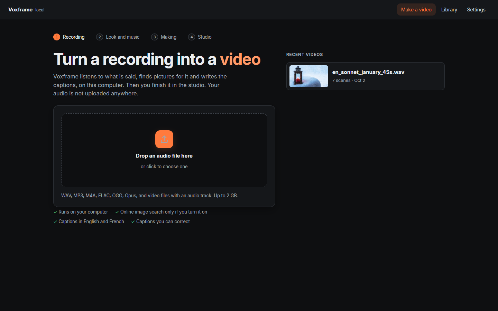
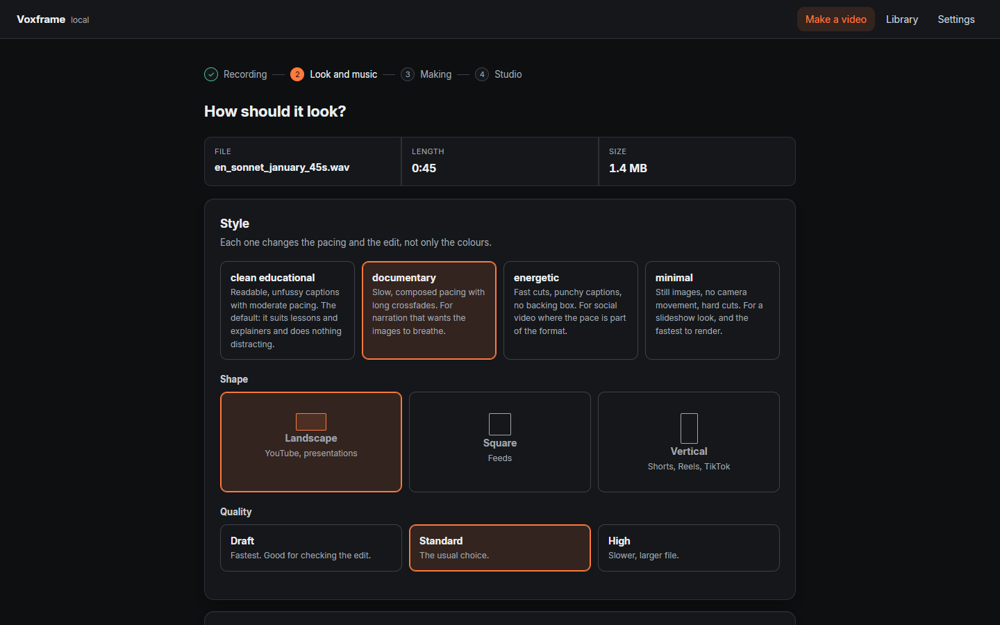

# Your first video

About five minutes, most of it waiting for the video to be made.

## 1. Choose a recording

Open Voxframe. Drop a recording onto the page, or click to choose one: a
lesson, a talk, a podcast episode. WAV, MP3, M4A, FLAC, OGG and videos with a
sound track all work.

Your recent videos are listed beside it; click one to open it in the studio.

## 2. Choose how it looks

Pick a style, a shape (landscape for YouTube, vertical for Shorts and Reels,
square for feeds) and a quality. Give it a title if you like — Voxframe never
invents one. You can add your own music, too.

Click **Make the video**. The page shows each step as it happens: hearing the
speech, finding pictures, making the video. A 45-second recording takes about a
minute on a normal laptop.

## 3. Finish it in the studio

When it is ready, the video opens in the studio. The video stays in view while
you work. Beside it are four tabs, and under it a timeline of every scene and
word. Click anywhere on the timeline to go there.

- **Scenes:** change the picture for the scene you're watching. Use one of the
  close matches, another picture Voxframe considered, or your own photo. You
  can also turn the camera movement on or off, or add a title or chapter card.
- **Captions:** click a word to jump to it, and correct what the captions say.
- **Sound:** the voice and the music.
  - **Voice:** Polished, for gentle noise reduction and a clearer tone, or
    Original, exactly as recorded.
  - **Music:** no music, or your own track, which you can add at any time.
  - **Levels:** how loud the voice and the music are, and how far the music
    drops while someone speaks.
  - **Made for:** YouTube, social media, WhatsApp or a podcast; the video is
    made to that loudness.

  Moving a slider plays 15 seconds from where you paused.
- **Style:** how the video was made, and the credits for every picture and
  track.

A changed picture shows over the video straight away, marked "not yet in the
video". Press **Ctrl+Z** to undo any change, and **Ctrl+Shift+Z** to redo it.
When you're happy, click **Update video**: only what you changed is made
again.

**Download** in the top bar has the video and its subtitles (SRT and VTT).
Press **?** for the keyboard shortcuts. `[` and `]` fold away the side panel
and the timeline, to give the video more room.

Prefer a light screen? **Settings → Appearance** has Dark, Light, and Follow
the system.

## Getting better pictures

Voxframe matches scenes against pictures in your **Library**. With an empty
library, scenes show a calm plain background. Two ways to fill it:

- **Library → Add your own photos and clips**, credited to you.
- **Settings → Search online for images**, with a free Pexels or Pixabay key:
  Voxframe then finds free stock pictures for scenes your library cannot fill,
  and credits each one.
